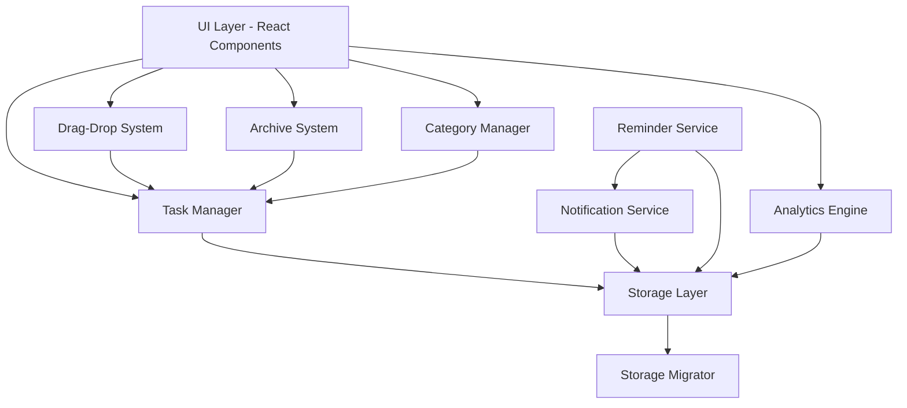

# Design Document: Pomodoro App Enhancements

  

## Overview

  

This design document specifies the technical architecture for enhancing the FocusFlow Pomodoro task management application with advanced productivity features. The enhancements transform the application from a basic task tracker into a comprehensive productivity intelligence platform.

  

### Key Enhancement Areas

  

1. **Drag-and-Drop Kanban Board**: Visual task management using @hello-pangea/dnd for intuitive status updates

2. **Sub-Task Management**: Hierarchical task breakdown with completion tracking

3. **Task Archiving**: Clean workspace maintenance while preserving historical data

4. **Native Browser Notifications**: Real-time alerts for timer completions and due dates

5. **Visual Analytics Dashboard**: Data visualization using recharts for productivity insights

6. **Rich Category Management**: Color-coded task organization by project or context

7. **Smart Due Date Reminders**: Proactive notification system for approaching deadlines

8. **Data Migration System**: Zero-downtime schema upgrades with automatic data preservation

  

### Design Principles

  

- **Progressive Enhancement**: New features integrate seamlessly with existing functionality

- **Data Integrity**: All migrations preserve existing user data without loss

- **Accessibility**: Keyboard navigation and screen reader support for all interactions

- **Performance**: Efficient rendering for large task lists using virtual scrolling where needed

- **Type Safety**: Comprehensive TypeScript types for all new data structures

- **User Control**: Explicit permission requests for browser APIs (notifications, audio)

  

## Architecture

  

### System Components

  



  

### Component Responsibilities

  

#### UI Layer

- **TaskList Component**: Renders tasks in list or Kanban view modes

- **TaskCard Component**: Individual task display with drag handle and actions

- **AnalyticsDashboard Component**: Visualizes productivity metrics using recharts

- **CategoryManager Component**: UI for creating and managing categories

- **ArchiveView Component**: Displays archived tasks with restore functionality

  

#### Business Logic Layer

- **Task Manager**: Core CRUD operations, status updates, sub-task management

- **Drag-Drop System**: Handles drag events, validates drops, updates task positions

- **Archive System**: Manages task archiving/unarchiving, filters archived tasks

- **Category Manager**: Category CRUD, color management, task-category associations

- **Analytics Engine**: Aggregates task data, calculates metrics, prepares chart data

- **Reminder Service**: Background polling, due date monitoring, notification triggering

- **Notification Service**: Browser API wrapper, permission management, fallback alerts

  

#### Data Layer

- **Storage Service**: localStorage abstraction for task persistence

- **Storage Migrator**: Schema version detection, migration execution, backup creation

  

### Technology Stack

  

- **Drag-and-Drop**: @hello-pangea/dnd (successor to react-beautiful-dnd)

- **Data Visualization**: recharts (React + D3 charting library)

- **Notifications**: Browser Notification API

- **State Management**: React hooks (useState, useEffect, useCallback)

- **Storage**: localStorage with JSON serialization

- **Type System**: TypeScript with strict mode enabled

  

## Components and Interfaces

  

### Drag-and-Drop System

  

The drag-and-drop system uses @hello-pangea/dnd which provides three core components:

  

1. **DragDropContext**: Top-level wrapper that enables drag-and-drop

2. **Droppable**: Defines drop zones (status columns)

3. **Draggable**: Wraps individual task cards

  

#### Implementation Structure

  

```typescript

<DragDropContext onDragEnd={handleDragEnd}>

  <div className="kanban-board">

    {['todo', 'in-progress', 'completed'].map(status => (

      <Droppable droppableId={status} key={status}>

        {(provided) => (

          <div ref={provided.innerRef} {...provided.droppableProps}>

            {tasks.filter(t => t.status === status).map((task, index) => (

              <Draggable draggableId={task.id} index={index} key={task.id}>

                {(provided) => (

                  <TaskCard

                    task={task}

                    dragHandleProps={provided.dragHandleProps}

                    draggableProps={provided.draggableProps}

                    innerRef={provided.innerRef}

                  />

                )}

              </Draggable>

            ))}

            {provided.placeholder}

          </div>

        )}

      </Droppable>

    ))}

  </div>

</DragDropContext>

```

  

#### Drag Event Handler

  

```typescript

interface DragEndResult {

  draggableId: string;

  source: { droppableId: string; index: number };

  destination: { droppableId: string; index: number } | null;

}

  

function handleDragEnd(result: DragEndResult): void {

  if (!result.destination) return; // Dropped outside valid zone

  const taskId = result.draggableId;

  const newStatus = result.destination.droppableId as TaskStatus;

  const newIndex = result.destination.index;

  // Update task status and position

  updateTaskStatus(taskId, newStatus);

  reorderTask(taskId, newIndex);

}

```

  

### Sub-Task Management

  

Sub-tasks are stored as an array within the parent task object. Each sub-task has its own identifier and completion state.

  

#### Sub-Task Interface

  

```typescript

interface SubTask {

  id: string;

  title: string;

  completed: boolean;

  createdAt: Date;

}

  

interface Task {

  // ... existing fields

  subTasks: SubTask[];

}

```

  

#### Sub-Task Operations

  

```typescript

// Add sub-task

function addSubTask(taskId: string, title: string): void {

  const subTask: SubTask = {

    id: crypto.randomUUID(),

    title,

    completed: false,

    createdAt: new Date()

  };

  updateTask(taskId, {

    subTasks: [...task.subTasks, subTask]

  });

}

  

// Toggle sub-task completion

function toggleSubTask(taskId: string, subTaskId: string): void {

  const task = getTask(taskId);

  const updatedSubTasks = task.subTasks.map(st =>

    st.id === subTaskId ? { ...st, completed: !st.completed } : st

  );

  updateTask(taskId, { subTasks: updatedSubTasks });

}

  

// Calculate completion percentage

function getCompletionPercentage(task: Task): number {

  if (task.subTasks.length === 0) return 0;

  const completed = task.subTasks.filter(st => st.completed).length;

  return Math.round((completed / task.subTasks.length) * 100);

}

```

  

### Archive System

  

The archive system uses a boolean flag to mark tasks as archived without deleting data.

  

#### Archive Operations

  

```typescript

function archiveTask(taskId: string): void {

  updateTask(taskId, { archived: true });

}

  

function unarchiveTask(taskId: string): void {

  updateTask(taskId, { archived: false });

}

  

function getActiveTasks(tasks: Task[]): Task[] {

  return tasks.filter(t => !t.archived);

}

  

function getArchivedTasks(tasks: Task[]): Task[] {

  return tasks.filter(t => t.archived);

}

```

  

### Notification Service

  

The notification service wraps the browser Notification API with permission management and fallback handling.

  

#### Notification Service Interface

  

```typescript

interface NotificationService {

  requestPermission(): Promise<NotificationPermission>;

  showNotification(title: string, options: NotificationOptions): void;

  isSupported(): boolean;

  getPermissionStatus(): NotificationPermission;

}

  

class BrowserNotificationService implements NotificationService {

  async requestPermission(): Promise<NotificationPermission> {

    if (!('Notification' in window)) {

      return 'denied';

    }

    const permission = await Notification.requestPermission();

    return permission;

  }

  showNotification(title: string, options: NotificationOptions = {}): void {

    if (Notification.permission === 'granted') {

      const notification = new Notification(title, {

        icon: '/icon.png',

        badge: '/badge.png',

        ...options

      });

      notification.onclick = () => {

        window.focus();

        notification.close();

      };

    } else {

      // Fallback to in-app alert

      this.showInAppAlert(title, options.body);

    }

  }

  isSupported(): boolean {

    return 'Notification' in window;

  }

  getPermissionStatus(): NotificationPermission {

    return Notification.permission;

  }

  private showInAppAlert(title: string, body?: string): void {

    // Display modal or toast notification within the app

  }

}

```

  

#### Timer Notification Integration

  

```typescript

function onTimerComplete(mode: 'work' | 'break'): void {

  const messages = {

    work: {

      title: 'Work session complete! Time for a break.',

      body: 'You completed a 25-minute focus session.'

    },

    break: {

      title: 'Break complete! Ready to focus?',

      body: 'Your break time is over. Start a new session?'

    }

  };

  const { title, body } = messages[mode];

  notificationService.showNotification(title, { body, tag: 'timer' });

}

```

  

### Analytics Engine

  

The analytics engine processes task data and generates chart-ready datasets using recharts components.

  

#### Analytics Data Structures

  

```typescript

interface AnalyticsData {

  dailyCompletions: Array<{ date: string; count: number }>;

  priorityDistribution: Array<{ priority: string; count: number }>;

  statusDistribution: Array<{ status: string; count: number; percentage: number }>;

  focusTimeByDay: Array<{ date: string; minutes: number }>;

  averagePomodoros: number;

  productivityTrend: Array<{ date: string; score: number }>;

}

  

interface DateRange {

  start: Date;

  end: Date;

}

```

  

#### Analytics Calculations

  

```typescript

function calculateAnalytics(tasks: Task[], dateRange: DateRange): AnalyticsData {

  const filteredTasks = filterByDateRange(tasks, dateRange);

  return {

    dailyCompletions: calculateDailyCompletions(filteredTasks),

    priorityDistribution: calculatePriorityDistribution(filteredTasks),

    statusDistribution: calculateStatusDistribution(filteredTasks),

    focusTimeByDay: calculateFocusTimeByDay(filteredTasks),

    averagePomodoros: calculateAveragePomodoros(filteredTasks),

    productivityTrend: calculateProductivityTrend(filteredTasks)

  };

}

```

  

#### Recharts Integration

  

```typescript

import { LineChart, Line, BarChart, Bar, PieChart, Pie, XAxis, YAxis, CartesianGrid, Tooltip, Legend } from 'recharts';

  

function AnalyticsDashboard({ data }: { data: AnalyticsData }) {

  return (

    <div className="analytics-dashboard">

      {/* Daily Completions Line Chart */}

      <LineChart width={600} height={300} data={data.dailyCompletions}>

        <CartesianGrid strokeDasharray="3 3" />

        <XAxis dataKey="date" />

        <YAxis />

        <Tooltip />

        <Legend />

        <Line type="monotone" dataKey="count" stroke="#8884d8" />

      </LineChart>

      {/* Priority Distribution Bar Chart */}

      <BarChart width={600} height={300} data={data.priorityDistribution}>

        <CartesianGrid strokeDasharray="3 3" />

        <XAxis dataKey="priority" />

        <YAxis />

        <Tooltip />

        <Legend />

        <Bar dataKey="count" fill="#82ca9d" />

      </BarChart>

      {/* Status Distribution Pie Chart */}

      <PieChart width={400} height={400}>

        <Pie

          data={data.statusDistribution}

          dataKey="count"

          nameKey="status"

          cx="50%"

          cy="50%"

          outerRadius={100}

          fill="#8884d8"

          label

        />

        <Tooltip />

      </PieChart>

    </div>

  );

}

```

  

### Category Manager

  

Categories provide visual organization through color-coding.

  

#### Category Interface

  

```typescript

interface Category {

  id: string;

  name: string;

  color: string; // Hex color code

}

  

interface CategoryManager {

  createCategory(name: string, color: string): Category;

  updateCategory(id: string, updates: Partial<Category>): void;

  deleteCategory(id: string): boolean;

  getCategories(): Category[];

  canDeleteCategory(id: string): boolean;

}

```

  

#### Category Operations

  

```typescript

const PREDEFINED_COLORS = [

  '#FF6B6B', '#4ECDC4', '#45B7D1', '#FFA07A',

  '#98D8C8', '#F7DC6F', '#BB8FCE', '#85C1E2',

  '#F8B739', '#52B788', '#E76F51', '#2A9D8F'

];

  

function createCategory(name: string, color: string): Category {

  return {

    id: crypto.randomUUID(),

    name,

    color

  };

}

  

function canDeleteCategory(categoryId: string, tasks: Task[]): boolean {

  return !tasks.some(task => task.categoryId === categoryId && !task.archived);

}

```

  

### Reminder Service

  

The reminder service runs background checks to identify approaching due dates and trigger notifications.

  

#### Reminder Configuration

  

```typescript

interface ReminderConfig {

  taskId: string;

  dueDate: Date;

  snoozedUntil?: Date;

  lastNotified?: Date;

}

  

interface ReminderService {

  startMonitoring(): void;

  stopMonitoring(): void;

  snoozeReminder(taskId: string, duration: '1h' | '3h' | 'tomorrow'): void;

  cancelReminder(taskId: string): void;

}

```

  

#### Reminder Monitoring

  

```typescript

class TaskReminderService implements ReminderService {

  private intervalId: number | null = null;

  private readonly CHECK_INTERVAL = 60 * 60 * 1000; // 60 minutes

  startMonitoring(): void {

    this.intervalId = window.setInterval(() => {

      this.checkDueDates();

    }, this.CHECK_INTERVAL);

  }

  stopMonitoring(): void {

    if (this.intervalId) {

      clearInterval(this.intervalId);

      this.intervalId = null;

    }

  }

  private checkDueDates(): void {

    const now = new Date();

    const tasks = getActiveTasks();

    tasks.forEach(task => {

      if (!task.dueDate) return;

      const timeUntilDue = task.dueDate.getTime() - now.getTime();

      const hoursUntilDue = timeUntilDue / (1000 * 60 * 60);

      // Check if already notified recently

      const reminder = this.getReminder(task.id);

      if (reminder?.lastNotified) {

        const timeSinceNotified = now.getTime() - reminder.lastNotified.getTime();

        if (timeSinceNotified < this.CHECK_INTERVAL) return;

      }

      // Check if snoozed

      if (reminder?.snoozedUntil && now < reminder.snoozedUntil) return;

      // Trigger notifications based on urgency

      if (hoursUntilDue <= 1 && hoursUntilDue > 0) {

        this.sendUrgentReminder(task);

      } else if (hoursUntilDue <= 24 && hoursUntilDue > 1) {

        this.sendStandardReminder(task);

      }

    });

  }

  private sendUrgentReminder(task: Task): void {

    notificationService.showNotification('⚠️ Urgent: Task Due Soon!', {

      body: `"${task.title}" is due in less than 1 hour`,

      tag: `reminder-${task.id}`,

      requireInteraction: true

    });

    this.updateLastNotified(task.id);

  }

  private sendStandardReminder(task: Task): void {

    notificationService.showNotification('📅 Task Due Today', {

      body: `"${task.title}" is due within 24 hours`,

      tag: `reminder-${task.id}`

    });

    this.updateLastNotified(task.id);

  }

  snoozeReminder(taskId: string, duration: '1h' | '3h' | 'tomorrow'): void {

    const now = new Date();

    let snoozedUntil: Date;

    switch (duration) {

      case '1h':

        snoozedUntil = new Date(now.getTime() + 60 * 60 * 1000);

        break;

      case '3h':

        snoozedUntil = new Date(now.getTime() + 3 * 60 * 60 * 1000);

        break;

      case 'tomorrow':

        snoozedUntil = new Date(now);

        snoozedUntil.setDate(snoozedUntil.getDate() + 1);

        snoozedUntil.setHours(9, 0, 0, 0);

        break;

    }

    this.updateReminder(taskId, { snoozedUntil });

  }

}

```

  

### Storage Migrator

  

The storage migrator ensures safe schema upgrades without data loss.

  

#### Migration System

  

```typescript

interface StorageSchema {

  version: number;

  tasks: Task[];

  categories: Category[];

}

  

interface Migration {

  version: number;

  up: (data: any) => any;

  down?: (data: any) => any;

}

  

const CURRENT_VERSION = 2;

  

const migrations: Migration[] = [

  {

    version: 1,

    up: (data) => {

      // Initial schema - no migration needed

      return data;

    }

  },

  {

    version: 2,

    up: (data) => {

      // Add new fields for enhancements

      return {

        ...data,

        tasks: data.tasks.map((task: any) => ({

          ...task,

          subTasks: task.subTasks || [],

          archived: task.archived || false,

          categoryId: task.categoryId || null

        })),

        categories: data.categories || []

      };

    }

  }

];

  

class StorageMigrator {

  migrate(): boolean {

    try {

      const rawData = localStorage.getItem('focusflow-data');

      if (!rawData) {

        // No existing data - initialize with current schema

        this.initializeSchema();

        return true;

      }

      const data = JSON.parse(rawData);

      const currentVersion = data.version || 0;

      if (currentVersion === CURRENT_VERSION) {

        return true; // Already up to date

      }

      // Create backup

      this.createBackup(rawData);

      // Apply migrations

      let migratedData = data;

      for (let v = currentVersion + 1; v <= CURRENT_VERSION; v++) {

        const migration = migrations.find(m => m.version === v);

        if (migration) {

          migratedData = migration.up(migratedData);

          migratedData.version = v;

        }

      }

      // Validate migrated data

      if (!this.validateSchema(migratedData)) {

        throw new Error('Migration validation failed');

      }

      // Save migrated data

      localStorage.setItem('focusflow-data', JSON.stringify(migratedData));

      return true;

    } catch (error) {

      console.error('Migration failed:', error);

      this.restoreBackup();

      return false;

    }

  }

  private createBackup(data: string): void {

    const timestamp = new Date().toISOString();

    localStorage.setItem(`focusflow-backup-${timestamp}`, data);

  }

  private restoreBackup(): void {

    const backupKeys = Object.keys(localStorage)

      .filter(key => key.startsWith('focusflow-backup-'))

      .sort()

      .reverse();

    if (backupKeys.length > 0) {

      const latestBackup = localStorage.getItem(backupKeys[0]);

      if (latestBackup) {

        localStorage.setItem('focusflow-data', latestBackup);

      }

    }

  }

  private validateSchema(data: any): boolean {

    return (

      typeof data.version === 'number' &&

      Array.isArray(data.tasks) &&

      Array.isArray(data.categories) &&

      data.tasks.every((task: any) =>

        task.id &&

        task.title &&

        Array.isArray(task.subTasks) &&

        typeof task.archived === 'boolean'

      )

    );

  }

  private initializeSchema(): void {

    const schema: StorageSchema = {

      version: CURRENT_VERSION,

      tasks: [],

      categories: []

    };

    localStorage.setItem('focusflow-data', JSON.stringify(schema));

  }

}

```

  

## Data Models

  

### Extended Task Type

  

```typescript

interface Task {

  // Existing fields

  id: string;

  title: string;

  description?: string;

  status: 'todo' | 'in-progress' | 'completed';

  priority: 'low' | 'medium' | 'high';

  createdAt: Date;

  dueDate?: Date;

  completedAt?: Date;

  totalFocusTime?: number;

  pomodorosCompleted?: number;

  // New fields

  subTasks: SubTask[];

  archived: boolean;

  categoryId: string | null;

}

```

  

### Sub-Task Type

  

```typescript

interface SubTask {

  id: string;

  title: string;

  completed: boolean;

  createdAt: Date;

}

```

  

### Category Type

  

```typescript

interface Category {

  id: string;

  name: string;

  color: string; // Hex color code (e.g., "#FF6B6B")

}

```

  

### Reminder Configuration Type

  

```typescript

interface ReminderConfig {

  taskId: string;

  dueDate: Date;

  snoozedUntil?: Date;

  lastNotified?: Date;

}

```

  

### Analytics Types

  

```typescript

interface AnalyticsDateRange {

  start: Date;

  end: Date;

}

  

interface DailyCompletion {

  date: string; // ISO date string

  count: number;

}

  

interface PriorityDistribution {

  priority: 'low' | 'medium' | 'high';

  count: number;

}

  

interface StatusDistribution {

  status: 'todo' | 'in-progress' | 'completed';

  count: number;

  percentage: number;

}

  

interface FocusTimeEntry {

  date: string; // ISO date string

  minutes: number;

}

  

interface ProductivityTrendPoint {

  date: string; // ISO date string

  score: number; // 0-100

}

```

  

### Storage Schema Type

  

```typescript

interface StorageSchema {

  version: number;

  tasks: Task[];

  categories: Category[];

  reminders?: ReminderConfig[];

}

```

  

### Filter Options Type

  

```typescript

interface TaskFilterOptions {

  status?: Task['status'];

  priority?: Task['priority'];

  categoryId?: string;

  archived?: boolean;

  search?: string;

  dateRange?: AnalyticsDateRange;

}

```